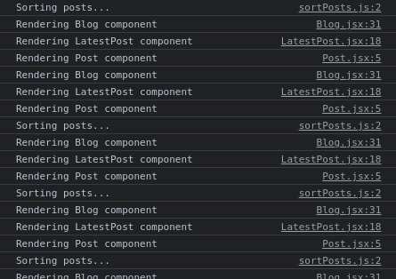

# Readme fayli ne ucundur?

lorem  lorem

## Github readme 2

### Github readme 3

#### Github readme 4

##### Github readme 5

###### Github readme 6

*italik* **qalin**  ***hem*** ~ortadan xett~ `vurgulu metn` #abcbd2 

```js
<div class="container">123</div>
```


[Facebook sehifem](https://www.facebook.com/ilkin944)



- html
-  css
- js

1. html
   - semantic teqler
        - div
2. css
3. js


> Qeyd: Quote